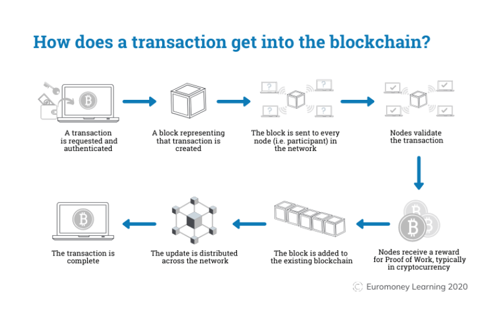
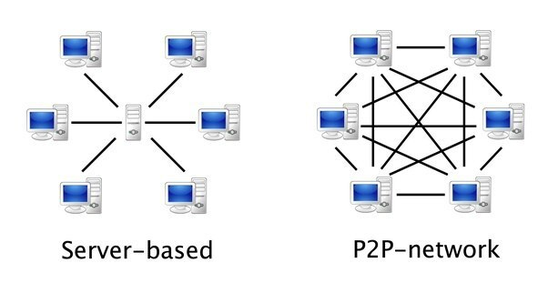
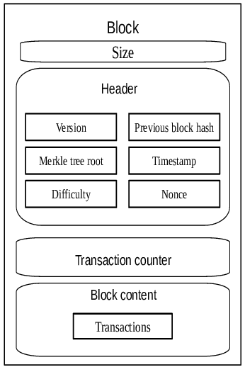
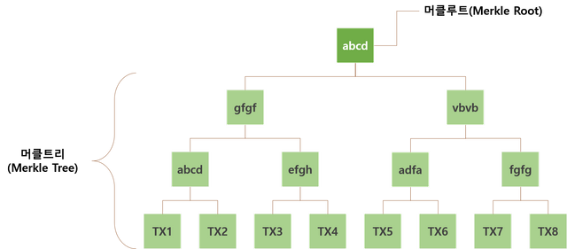
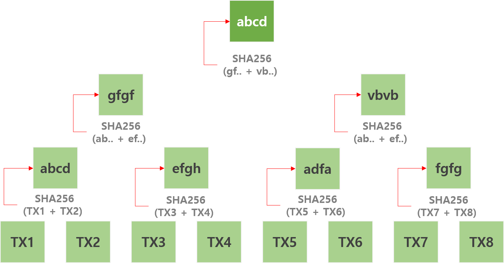

### :smiley: 3일차
  

**주제 :블록체인 개발 입문 **
---

*Gartner에 따르면 2024년까지 대기업의 20%가 결제, 가치저장, 담보로 디지털 화폐를 사용할 것이라는 전망으로, 오늘날 세계에서 가장 빠르게 성장하고 있는 기술 분야 중 하나이다.*

**📍프로젝트 개요**

**Part1**
블록체인을 개발하기 위한 기초 학습(원리)과 개발환경 구성

**Part2**
간단한 블록체인을 코딩하여 생성

😦 블록체인이 뭘까..?난 아무것도 몰라요..

---

**📍과제 목표**

* 블록체인이 무엇이고 어떻게 동작하는지 학습
* 블록 생성해서 결과 제출

---

**📍학습 자료**

*✔️블록체인이란*

: 데이터 분산 처리 기술로, "데이터를 암호화해서 저장하는 하나의 단위"인 "블록(Block)"에 데이터를 담아 체인(Chain) 형태로 연결하여 수많은 컴퓨터에 동시에 이를 복제해 저장하는 기술이다.

* 누구도 임의로 수정할 수 없고, 누구나 변경의 결과를 열람할 수 있다..!


*✔️블록체인의 작동원리*

: 다수의 온라인 거래 기록을 묶어서 하나의 "블록(Block)"을 구성한 뒤, "해시(Hash)" 값을 이용하여 이전 블록과 "체인(Chain)"처럼 연결한다.

* 블록(Block)은 "헤더(Header)" 와 "거래(Transaction)" 리스트로 이루어져 있다
  * 각 거래기록의 최소 단위를 Transaction 이라고 한다.
* Transaction이 만들어지면 "P2P"로 모든 "노드(Node)"에 "브로드캐스팅(Broadcasting)"을 한다
  * 노드(Node)는 블록체인 네트워크에 연결되어 있는 모든 서버(Server) 이다.
* 각 노드(Node)에서는 거래기록을 모아 블록(Block)을 생성한다.
---


*Source from euromoney.com*
* Transaction(코인 전송) 작성 > P2P Net.으로 Broadcasting > 각 노드(Node)에서 대기 및 블록(Block)생성 > 완성된 블록(Block) Broadcasting > 모든 노드가 블록(Block) 검증


*⚠️P2P Net. 이란?*



*Source from borntodevelop.tistory.com*

Peer-to-Peer Network 의 약자로 네트워크로 같이 연결되어있는 컴퓨터들이 클라이언트와 서버의 기능을 하는 네트워크를 뜻한다.

>쉽게 말하면, 클라이언트 컴퓨터간에 직접적으로 통신하는 방식이다!

*✔️마이닝(Mining)*

* 각 노드에서 만든 블록이 모두 허용되는 것은 아니며, 주어진 "난이도"에 따라 블록의 "해쉬값"을 계산하여 조건에 가장 부합하는 블록이 새롭게 "체인(Chain)"에 추가되는 블록으로 선택됨. 이 과정을 채굴 / 마이닝(Mining) 이라고 부른다. 

* 이렇듯 무작위 선정된 검증인을 기반으로 하는 블록체인 네트워크에 대해 새로운 블록을 추가하는 합의 메커니즘(알고리즘) 을 작업증명(PoW) 이라고 한다. 

*⚠️PoW 란?*

Proof-of-Work 의 약자로 목표값 이하의 해시를 찾는 과정을 반복하여 해당 작업에 참여했음을 증명하는 방식의 합의 알고리즘이다. 채굴(mining)을 통해 작업증명(PoW)를 한다.

* 왜 필요할까?

  * 작업증명 알고리즘은 네트워크의 모든 노드(서버)가 동시에 블록을 생성할 수 없게 하는 것에 의의가 있다. 작업증명을 통과해야만 블록을 생성할 수 있다. 
  * 난이도 조절 알고리즘을 통해 10분당 1-2개의 블록이 생성됨을 보장한다. 

*✔️블록(Block)*



*Source from www.researchgate.net*
* Header + Body 의 구성
* Block의 대부분은 Transaction으로 구성됨

* Block은 일정 시간마다 여러건의 거래내역을 하나의 블록으로 나타냄

**🍄✨과제1**
---
Header를 구성하고있는 이전 블록 해시 값(Previous block hash), 머클트리 루트(Merkle tree root), 난이도(Difficulty), 논스(Nonce) 값이 무엇인지 학습을 진행해 주십시오.


*✔️이전 블록 해시 값(Previous block hash)*
*✔️머클트리 루트(Merkle tree root)*
*✔️난이도(Difficulty)*
*✔️논스(Nonce)*


✔️이전 블록 해시 값(Previous block hash)

"이전 블록 헤더 해시" 는 블록체인을 체인(Chain)으로 묶어주는 데 중요한 개념이다. 

EX > 101번째 block을 mining하려는 채굴자(Node, Server)가 100번째 block을 전달받았을 떄 해당 블록의 header 데이터를 두 번 해시해서 101번째 block에 담는다.

* 블록체인은 블록들이 연결된 연결 리스트 구조를 가지고 있기 때문에, 각 블록은 이전 블록의 해시 값을 가지고 있다. 이는 이전 블록의 데이터와 메타데이터(header의 데이터)에 대한 해시 값이다.

* 역할 : 
  * 무결성 유지 - 한 번 추가된 블록은 이전 블록과의 연결성을 가지게 된다. 이전 블록의 내용이 변경되면 해당 블록의 해시 값도 변경되어 현재 블록에 영향을 미치게 되므로 무결성을 유지할 수 있다. 

  * 순서 유지 - 이전 블록의 해시 값은 그 블록의 위치를 정의하고, 블록체인에서의 순서를 결정한다. 

  * 이전 블록 해시를 사용함으로써 블록체인은 변경이 어렵고 검증이 간편한 불변의 거대한 분산 대형장부를 형성하게 된다.

  

✔️머클트리 루트(Merkle tree root) 

  💡 그전에..해시함수란? 

  * 임의의 길이를 갖는 메세지를 입력받아서 고정된 길이의 해시값을 출력하는 함수
  * 키를 사용하지 않으므로 같은 입력에 대해서는 항상 같은 출력이 나오게 된다
    * 눈사태 효과 : 입력 값의 아주 일부만 변경되어도 전혀 다른 출력값이 나온다
    * 출력값을 토대로 입력값을 유추할 수 없다
    * 메시지의 오류나 변조를 탐지할 수 있는 무결성 보장

* 머클트리(Merkle Tree)
 * 해시트리라고도 불리는 데이터 구조로, 빠른 검색이 아니라 데이터의 간편하고 확실한 인증을 위해 사용
  * 블록체인의 원소 역할을 수행하는 블록의 부분에 저장된 transaction들의 해시트리
* 머클루트(Merkle Root)
  
  * 블록의 body 는 각 거래정보인 transaction의 정보로 구성이 되는데, 블록의 body 정보에 저장된 transaction의 정보들이 유효한지 빠르게 검사하기 위한 역할을 수행하는 것이 머클루트 정보이다.



* 머클루트가 만들어지는 과정
  * 최초 데이터를 SHA256 형태의 해시값으로 변환
  * 가장 가까운 노드 2개를 한쌍으로 묶어 합친 후 해시값으로 변환
  * 계속해서 해시값으로 변환하여 마지막 하나가 남을때까지 이 과정 반복



* 각 해시된 결과값 TXID의 노드를 2개씩 짝지어 합친 후, 다시 SHA256 함수를 통해 해시 값으로 변환하고 .... 최종적으로 나온 하나의 노드값이 머클루트(Merkle Root) 값이 됨.

**결론 : Block의 Header 의 Merkle Tree Root 값은 Block Body의 Transaction 정보들 TXID를 계속해서 SHA256 해시함수로 해시했을 때의 해시트리 결과 값이다**

* Merkle Root 의 역할 : 각 transaction(TXID)의 정보들이 변경되었는지에 대한 유효성을 검사한다.

* Merkle Root의 결과값을 통해 Block Hash의 정보가 구성되므로 그 Block 의 유효성 또한 검사된 것.

*Referred from*
https://www.codestates.com/blog/content/%EB%B8%94%EB%A1%9D%EC%B2%B4%EC%9D%B8-%EA%B5%AC%EC%A1%B0%EC%99%80-%EB%B8%94%EB%A1%9D%EC%B2%B4%EC%9D%B8-%ED%8A%B8%EB%9E%9C%EC%9E%AD%EC%85%98
https://steemit.com/kr/@yahweh87/2*
https://steemit.com/kr/@yahweh87/4-merkle-tree-merkle-root

✔️난이도(Difficulty)

* 블록을 채굴할 떄의 난이도이며, 블록의 높이에 따라 자동 설정된다.

* 채굴자(Miner)는 일종의 수학문제를 풀고, 문제를 풀었을 경우 새로운 블록을 생성한다.

* 난이도가 높을 경우
  * 새로운 블록을 찾는데 걸리는 소요시간이 길어져 거래속도가 느려진다
* 난이도가 낮을 경우
  * 새로운 블록을 찾는 속도가 증가해서 거래속도가 빨라진다
  * 동시에 블록을 생성할 확률이 높아진다 = 스테일 블록이 발생활 확률이 높아진다
  * 이는 transaction의 확인을 지연시키고, 스테일 블록뒤에 이어지는 모든 블록은 불필요한 연산을 한 결과이기 때문에 자원 낭비가 일어난다
* 따라서, 스테일 블록의 확률은 낮추면서 거래속도는 향상될 수 있는 방법을 찾는 것이 중요하다.

* 난이도에 맞는 목푯값이 존재하며 'Bits'로 표기된다. 
* 목표값보다 낮은 해시값을 찾는 과정이 채굴이다. 

Difficulty = MAX_TARGET / current_target
* MAX_TARGET은 ‘첫 난이도’로서 비트코인 블록체인이 처음 구동될 때 설정된 난이도 값으로 값 ‘1’을 의미하며, 4바이트로 ‘1d00ffff’라고 표기
* ‘bits’값인 388618029를 16진법으로 변환하면 0x1729d72d의 값이 나온다. bits는 지수와 계수로 표기된다고 설명하였다. 첫 1바이트는 지수, 이후 3바이트는 계수가 된다. 즉, 해당 bits는 0x17는 지수, 0x29d72d 계수가 된다. (0x는 16진법을 의미한다.)

*Reference https://medium.com/@dongha.sohn/bitcoin-6-%EB%82%9C%EC%9D%B4%EB%8F%84%EC%99%80-%EB%AA%A9%ED%91%AF%EA%B0%92-9e5c0c12a580*

✔️논스(Nonce)

: "Number Used Only Once(한 번만 사용되는 번호)"의 합성어

* Miner 가 새로운 Block을 채굴하고 그에 대해 보상받기 위해 찾으려고 하는 Nonce

* Miner는 Block 의 Header에 있는 Nonce 를 조정해서 Block 의 해시 값이 특정 조건을 만족해서 유효한 해시 값을 가지도록 한다. 이 작업을 Proof-of-Work(작업 증명) 이라고 하고, 이 과정을 통해 새로운 블록이 blockchain에 추가된다

* Miner가 올바른 Nonce를 찾을 때까지 시도됨. 이렇게 발견된 Nonce는 블록의 Header에 포함되고, 블록의 해시가 목표치 이하로 되어야 해당 블록이 유효한 것으로 간주됨. 

* Mining은 Block Header의 데이터인 버전, 이전 블록 헤더 해시, 머클 루트, 타임 스탬프, 난이도 목표 와 논스(Nonce)를 조합해 목표에서 정한 값보다 작은 해시값을 찾는 것이다. 
  * Nonce 이외의 5가지 데이터는 모두 자동으로 주어지거나, 계산되는 고정값
  * 블록을 생성할 때 헤더에 담기는 데이터 중 주어지거나, 계산하지 않는 값이 바로 논스(Nonce) 이다
  * 채굴 과정에서 변수값을 적용해가며 목표값보다 낮은 해시값을 찾아야 하는데 여기서 변수값이 논스이다.

* 즉, Nonce를 찾는 과정은 블록체인의 분산된 네트워크에서 어려운 계산 문제를 해결하는 과정으로, 이는 블록 생성에 대한 경쟁력을 제공하고 보안성을 높이는 역할을 한다.

* 마이너가 올바른 Nonce를 찾으면, 그 블록이 블록체인에 추가되고, 마이너는 블록 보상으로 비트코인을 받게된다. 이렇게 Nonce를 찾는 작업은 블록체인의 분산된 합의 메커니즘의 일부로써 중요한 역할을 한다.

*Reference https://www.codestates.com/blog/content/%EB%B8%94%EB%A1%9D%EC%B2%B4%EC%9D%B8-%EA%B5%AC%EC%A1%B0%EC%99%80-%EB%B8%94%EB%A1%9D%EC%B2%B4%EC%9D%B8-%ED%8A%B8%EB%9E%9C%EC%9E%AD%EC%85%98*


---
*✔️블록 해시(Block Hash)*
: 블록 Header 정보를 입력 값으로 SHA256 해시 함수를 적용해서 계산되는 값

* 해시 값은 해시 함수를 사용해서 32bite의 숫자 값을 출력한다
* Blockchain에서는 블록 전체를 해시한 값이 아니라 블록 Header를 해시한 값을 사용한다

**🍄✨과제2**
---
1. 이더리움 테스트 네트워크 중 개인 테스트용 사설 테스트 넷을 구성하고 화면을 캡쳐하여 제출
2. 위 과제를 수행하며 만든 제네시스 블록 파일을 제출

* 사설 네트워크 구축을 위해서는 "제네시스 블록 파일"과 "블록 데이터 폴더"가 필요하다
* 블록체인에서 가장 먼저 생성되는 블록을 "제네시스 블록" 이라고 한다
---

**제네시스 블록 파일 생성**

[이더리움 오픈소스](https://github.com/ethereum/go-ethereum)

* Genesis 파일은 JSON 형식으로 네트워크 설정을 저장하고, 이 파일을 먼저 만들어야 나만의 이더리움 네트워크를 가동할 수 있다. 


```
Operating a private network
Maintaining your own private network is more involved as a lot of configurations taken for granted in the official networks need to be manually set up.

Defining the private genesis state
First, you'll need to create the genesis state of your networks, which all nodes need to be aware of and agree upon. This consists of a small JSON file (e.g. call it genesis.json):


{
  "config": {
    "chainId": <arbitrary positive integer>,
    "homesteadBlock": 0,
    "eip150Block": 0,
    "eip155Block": 0,
    "eip158Block": 0,
    "byzantiumBlock": 0,
    "constantinopleBlock": 0,
    "petersburgBlock": 0,
    "istanbulBlock": 0,
    "berlinBlock": 0,
    "londonBlock": 0
  },
  "alloc": {},
  "coinbase": "0x0000000000000000000000000000000000000000",
  "difficulty": "0x20000",
  "extraData": "",
  "gasLimit": "0x2fefd8",
  "nonce": "0x0000000000000042",
  "mixhash": "0x0000000000000000000000000000000000000000000000000000000000000000",
  "parentHash": "0x0000000000000000000000000000000000000000000000000000000000000000",
  "timestamp": "0x00"
}

The above fields should be fine for most purposes, although we'd recommend changing the nonce to some random value so you prevent unknown remote nodes from being able to connect to you. 
```

**테스트용 사설 테스트 네트워크 구성**

[geth 다운로드](https://geth.ethereum.org/downloads)

* c:\geth 에서 cmd 창을 연다
* 블록체인을 저장할 경로를 만든다
  * mkdir c:\my_blockchain
* 생성한 genesis.json 블록을 복사해서 c:\my_blockchain 경로에 붙여넣는다 
* 블록 데이터 폴더 생성
  * geth --datadir c:\my_blockchain init c:\my_blockchain\genesis.json
* my_blockchain 폴더에 geth, keystore 폴더가 생성된 것을 확인할 수 있다
  * geth : 모든 체인에 대한 데이터 저장
  * keystore : 계정들에 대한 정보를 관리
* 계정 생성
  * get account new --datadir c:\my_blockchain
  * 비밀번호 입력
  * 생성된 계정 정보 확인
    * geth account list --datadir c:\my_blockchain 


**사설 테스트넷 기동**

* genesis.json 의 config의 chainId 값을 networkid 값과 일치

  * C:\Program Files\Geth>geth --networkid 921 --nodiscover --maxpeers 0 --datadir c:\my_blockchain console 2>>c:\my_blockchain\gethErr.log
  * 오류발생 : Fatal: Failed to register the Ethereum service: ethash is only supported as a historical component of already merged networks

* geth를 콘솔 모드로 실행 
  * geth --identity "MyNodeName" --genesis /path/to/CustomGenesis.json --rpc --rpcport "8080" --rpccorsdomain "*" --datadir "/path/to/TestChain" --port "30303" --nodiscover --rpcapi "db,eth,net,web3" --networkid 1999 console
  * "MyNodeName" 은 원하는 노드 이름으로 수정하시고, 제네시스 파일 및 데이터 디렉토리도 각각 본인의 환경에 맞게 수정


